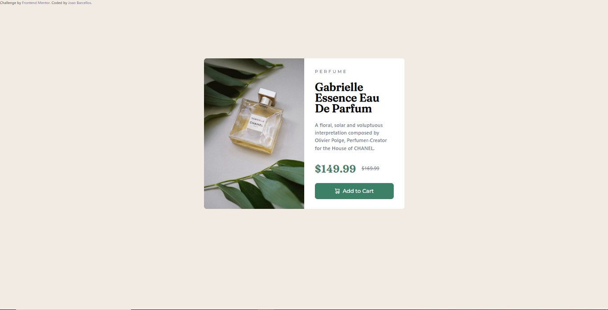

# Getting Started with Vite React

## Available Scripts

In the project directory, you can download this arquive:

### `cd product-preview-card-component-main`
### `npm install`
### `npm run dev`

and finish to run in your desk.

# Frontend Mentor - Product preview card component solution

This is a solution to the [Product preview card component challenge on Frontend Mentor](https://www.frontendmentor.io/challenges/product-preview-card-component-GO7UmttRfa). Frontend Mentor challenges help you improve your coding skills by building realistic projects. 

## Table of contents

- [Overview](#overview)
  - [The challenge](#the-challenge)
  - [Screenshot](#screenshot)
  - [Links](#links)
- [My process](#my-process)
  - [Built with](#built-with)
  - [What I learned](#what-i-learned)
  - [Useful resources](#useful-resources)
- [Author](#author)

## Overview

### The challenge

Users should be able to:

- View the optimal layout depending on their device's screen size
- See hover and focus states for interactive elements

### Screenshot




### Links

- Solution URL: [Add solution URL here](https://github.com/legonnexon/product-preview-card-component-main.github.io/)
- Live Site URL: [Add live site URL here](https://github.com/legonnexon/product-preview-card-component-main.github.io/) don't work with vite ;-;

## My process

### Built with

- Semantic HTML5 markup
- CSS custom properties
- Flexbox
- CSS Grid
- Mobile-first workflow
- [React](https://reactjs.org/) - JS library
- [Next.js](https://nextjs.org/) - React framework
- [Tailwind](https://tailwindcss.com/) - For styles


### What I learned

I learned Tailwind in practive and this is... very difficult I don't like this but with this css helper i lern about flex, flexbox and images and yours classes. I feel like it makes no sense what are variables in css hehe

I see too Vite and I have nothing to say about.

To see how you can add code snippets, see below:

```html
<div className="text-left rounded-full md:w-[600px] h-[450px] md:flex">
```
```css
.image {
  object-fit: cover; <--
}
```

If you want see more click [here](https://www.frontendmentor.io/challenges/product-preview-card-component-GO7UmttRfa)


### Useful resources

- [Tailwind Docs](https://tailwindcss.com/docs/installation) - Well...
- [Stack Overflow](https://stackoverflow.com/) - This is an amazing site.


## Author

- Website - [Joao Barcellos](https://www.github.com/legonnexon/)
- Frontend Mentor - [@legonnexon](https://www.frontendmentor.io/profile/legonnexon)
